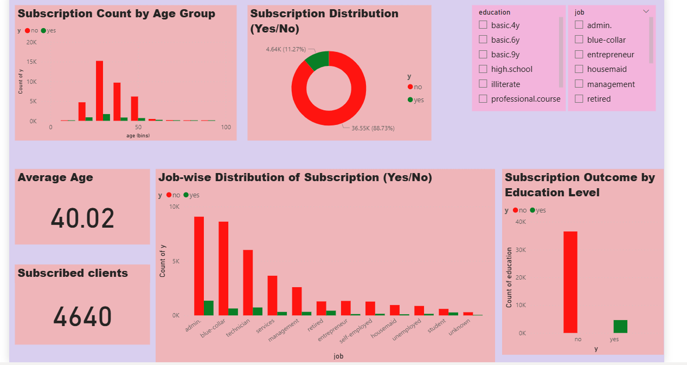

# 🏦 Bank Marketing Subscription Prediction (ML + Power BI)

This project focuses on predicting whether a client will subscribe to a term deposit based on their demographic and behavioral data. The solution combines **Exploratory Data Analysis (EDA)** in Power BI and a **Machine Learning classification model** in Python. Further the best model pipeline is selected and wrapped in an API using FASTAPI. It is further connected with a streamlit frontend. Let us have a walkthrough for a complete project.

---

## 🔍 Problem Statement

Marketing campaigns are costly and time-sensitive. Using client data from a Portuguese bank, the goal is to build a machine learning model to:
- Identify customers who are likely to subscribe to a term deposit.
- Help the bank make informed targeting decisions for future campaigns.

---

## 📁 Dataset

- **Source**: UCI Bank Marketing Dataset  
- **Records**: 41,188  
- **Target Variable**: `y` → (Subscribed: Yes/No)

Key features:
- Age, Job, Marital Status, Education  
- Balance, Housing loan, Previous contact outcomes  
- Duration of last contact, Campaign details, etc.

---

## 🧠 Machine Learning Approach

### ✅ Steps:
1. **Data Cleaning** (handled unknowns, encoded categories)
   Data is clenaed and preprocessed where categorical variables are encoded using OneHotEncoder() and numerical varibales are standardized using StandardScaler().
2. **Exploratory Data Analysis** (Power BI visualization)
   A basic PowerBI dashboard is used for viewing the important insights of the dataset.
   
3. **Balancing**: Used SMOTE to handle class imbalance
The data was highly imbalanced as it is also evident from the dashboard below and also when value_counts are calculated for the dataset with respect to the the target variable (y), the results are as follows:
y
no     36548
yes     4640
Name: count, dtype: int64
Normally, the datasets of the marketing campaign are highly imbalanced. The main reason is the fact that only a small people subscribe, while most of the people dont subscribe on these compaigns which is significantly highlighted in the data.
4. **Model Selection**:
   - Logistic Regression   
   - Random Forest  
   - XGBoost (Best performer)
5. **Evaluation**:
   - Classification Report  
   - ROC-AUC Curve

---

## 📊 Power BI Dashboard

An interactive Power BI dashboard was created to understand:
- Subscription distribution across jobs, age groups, marital status
- Balance and duration impact
- Overall success rate of marketing campaign

 

---

## ⚙️ Tools & Technologies

- **Python** (Pandas, Scikit-learn, XGBoost, Matplotlib)
- **Power BI** for EDA and storytelling
- **VS Code/Jupyter Notebook**
- **SMOTE** for class balancing
- **FastAPI**
- **Streamlit**

---

## 📈 Results
The ROC-AUC scores of the all the models are listed below. The top performer is XGBoost follwed by random forest and then Logistic regression. The ROC-AUC scores are listed below for better understanding.

Training model: Random Forest
Random Forest ROC-AUC: 0.9471

Training model: Logistic Regression
Logistic Regression ROC-AUC: 0.9435

Training model: XGBoost
XGBoost ROC-AUC: 0.9515

Best model: XGBoost with ROC-AUC: 0.9515

Below the classification report is also shown for XGBoost, as the model out performes the other models.
Classificatioin report:
              precision    recall  f1-score   support

           0       0.96      0.94      0.95      7310
           1       0.60      0.72      0.65       928

    accuracy                           0.91      8238
   macro avg       0.78      0.83      0.80      8238
weighted avg       0.92      0.91      0.92      8238

ROC-AUC curve: 0.9515

**Explanation for Classification Report**

**Majority Class**
Class 0 (likely "no subscription"):

Precision: 0.96 → 96% of predicted class 0 were correct.

Recall: 0.94 → 94% of all true class 0 were correctly predicted.

F1-Score: 0.95 → High overall balance.

**Minority Class**
Class 1 (likely "yes subscription"):

Precision: 0.60 → Only 60% of predicted class 1 were correct.

Recall: 0.72 → XGBoost correctly identified 72% of all class 1.

F1-Score: 0.65 → Moderate performance due to class imbalance.

Accuracy: 91% → Overall correctness.

The model performes well on the majority class but have also shown some areas where improvement can be done in future such as for the metrics precision, recall and F1 score for minority as these are most important values to look for in the case of highly class imbalance dataset which is we are dealing with in this case. Nevertheless, a good recall is achieved having a value of 0.72 meaning our model catches 72% of the class 1 correctly or the people who have subscribed in this case. An overall good ROC-AUC score of 0.9515 is acheived in this case for XGBoost showing an excellent ability of the model to separate among the classes (0 and 1).

**AUC = 1: Perfect separation**

**AUC > 0.90: Excellent**

**Saved best model: XGBoost**

**Why XGBoost Outperformed Random Forest and Logistic Regression?**
One basic reason of XGBoost outperforming random forest is the mehanism working behind them. Both are ensemble techniques but random forest works on Bagging mechanism whereas XGBoost works on Boosting mechanism. XGBoost uses gradient boosting, which focuses on correcting previous errors, leading to better handling of complex patterns and class imbalance. On the otherhand, Random Forest uses bagging, which trains independent trees and averages the results. It doesn’t correct mistakes as boosting does.

---
